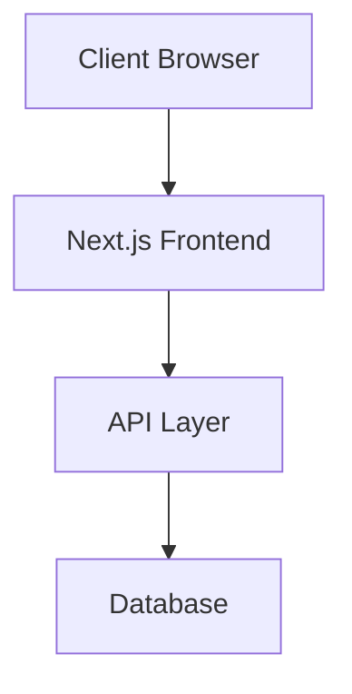

# Architecture & Engineering Principles

This document outlines the key architectural decisions, engineering principles, and technical choices that shape Afiado.

## Core Engineering Principles

### 1. Simplicity Over Complexity
- Prefer simple, maintainable solutions over clever optimizations
- Keep the codebase approachable for new contributors
- If a feature feels complex, it probably needs more design thinking

### 2. Type Safety is not optional
- Maintain strict type checking configurations
- Document type definitions clearly

### 3. Testing as a First-Class Citizen
- Maintain high test coverage for critical paths
- Write tests that serve as documentation
- Follow the testing pyramid: unit → integration → e2e

### 4. Performance by Default
- Consider performance implications in every PR
- Optimize for core web vitals
- Regular performance monitoring and benchmarking

### 5. Mobile First UI
- Build for mobile first, then desktop
- Use responsive design patterns
- Optimize for touch interactions

### 6. Build Fast, Ship Faster
- Optimize build times, for both development and production
- The faster we can build, the faster we can ship
- Use CI/CD to automate builds and tests

### 7. We love open source
- Prefer open source tools and libraries
- Share our learnings with the community
- Keep the CHANGELOG up to date

## Architecture Overview

### System Components

## Technology Choices

For each technology choice, we will consider the following:

- Context: What is the problem we are trying to solve?
- Considered Alternatives: What other technologies did we consider? List at least 3 alternatives.
- Consequences: What are the trade-offs of the chosen technology? What are the mitigation strategies for the negative consequences?

Summary of the technology choices:

- [Frontend Framework: Next.js](#frontend-framework-nextjs)
- [Auth Provider: Clerk](#auth-provider-clerk)
- [Backend: Convex](#backend-convex)
- [Payments: AbacatePay + Lemon Squeezy by Stripe](#payments-abacatepay-lemon-squeezy-by-stripe)
- [Styling: TailwindCSS](#styling-tailwindcss)
- [Component Library: Shadcn/ui](#component-library-shadcn-ui)
- [Product Analytics: PostHog](#product-analytics-posthog)
- [Web Analytics: PostHog](#web-analytics-posthog)
- [SEO Tracking: aHrefs + MakeMeFindable](#seo-tracking-ahrefs-makemefindable)
- [DNS: Cloudflare](#dns-cloudflare)
- [Transactional E-mails: Resend](#e-mail-resend)
- [Package Manager: Bun](#package-manager-bun)
- [Linting: Biome](#linting-biome)
- [Formatting: Biome](#formatting-biome)
- [Unit Testing: Vitest](#unit-testing-vitest)
- [E2E Testing: Playwright](#e2e-testing-playwright)
- [Deployment: Cloudflare Pages](#deployment-cloudflare)
- [Documentation: Fumadocs](#documentation-fumadocs)
- [Sync Engine: LegendState](#sync-engine-legendstate)
- [Error Handling: Neverthrow](#error-handling-neverthrow)
- [Forms: Tanstack Form](#forms-tanstack-form)
- [Validation: Zod](#validation-zod)

### Frontend Framework: Next.js

**Context:**
- Need for a modern framework with recognizable patterns, helping new developers get up to speed quickly
- Looking for excellent developer experience
- Require strong TypeScript support

**Considered Alternatives:**
1. [Next.js](https://nextjs.org/)
2. [React Router (Framework Mode)](https://reactrouter.com/)
3. [Tanstack Start](https://tanstack.com/start)

**Consequences: Next.js**
- Positive:
  - Faster development cycles, since is widely regarded as the de facto framework for starting a React project
  - Built-in performance optimizations
  - Great DX with hot reload and turbopack improvements reducing build times
  - Strong ecosystem, backed by Vercel
  - Allows for starting with static generation, but also has the ability to be server-side rendered
- Negative:
  - Learning curve for developers new to Next.js
  - Some lock-in to Vercel's ecosystem
  - Need to follow Next.js upgrade cycles

### Auth Provider: Clerk

**Context:**
- Need for a modern auth provider with a strong focus on user experience
- Looking for a provider that is easy to integrate with
- Preferably hosted solution, but we can self-host if necessary
- Require strong TypeScript support

**Considered Alternatives:**
1. [Clerk](https://clerk.com/)
2. [BetterAuth](https://better-auth.com/)
3. [WorkOS](https://workos.com/)

**Consequences: Clerk**
- Positive:
  - Strong TypeScript support
  - Excellent developer experience
  - Active community
  - Excellent documentation
  - Excellent support for social login providers
- Negative:
  - Some lock-in to Clerk's ecosystem
  - Hard to onboard Enterprise customers with multiple sign-in methods and users with different roles
- Mitigation Strategies:
  - [WorkOS](https://workos.com/) has a Admin Portal and a more flexible role-based access control (RBAC)
  - [BetterAuth](https://better-auth.com/) enables us to self-host and have more control over the user experience and the data we store about our users

### Backend: Convex

**Context:**
- Need for a modern backend framework with a strong focus on user experience
- Looking for a provider that is easy to integrate with
- Looking for an alternative that is easy to implement Real-Time Data Sync
- Offline-first approach is nice plus.
- Require strong TypeScript support

**Considered Alternatives:**
1. [Convex](https://www.convex.dev/)
2. [Supabase](https://supabase.com/)
3. [Firebase](https://firebase.google.com/)

**Consequences: Convex**
- Positive:
  - Good support for Real-Time Data Sync
  - Good support for Offline-first approach
  - Good support for TypeScript
- Negative:
  - Some lock-in to Convex's ecosystem
  - When offline Convex enqueues requests to be sent when the user comes back online, but to be fully offline-first we need to add some third-party libraries

### Payments: AbacatePay + Lemon Squeezy by Stripe

**Context:**
- Need for a modern payments provider with a strong focus on user experience
- Looking for a provider that is easy to integrate with
- Good support for PIX, Brazilian instant payment method
- Require strong TypeScript support
- Prefer MoR over Payment Gateway, wherever possible

**Considered Alternatives:**
1. [AbacatePay](https://abacate.com.br/)
2. [Stripe](https://stripe.com/)
3. [Lemon Squeezy](https://lemonsqueezy.com/)
4. [Polar](https://polar.sh/)

**Consequences: AbacatePay + Lemon Squeezy by Stripe**
- Positive:
  - Good support for PIX, Brazilian instant payment method, using AbacatePay
  - Good support for Card, using Lemon Squeezy by Stripe
  - Smallest fees in comparison to other providers
  - Easy to integrate with
  - Strong TypeScript support
- Negative:
  - Lock-in to AbacatePay and Lemon Squeezy's ecosystem and payout limitations
  - Need to use Paypal Account to receive Lemon Squeezy payouts
- Mitigation Strategies:
  - [Polar](https://polar.sh/) has smaller fees, but Brazilian accounts are not supported for payouts; see more @ https://github.com/orgs/polarsource/discussions/3494#discussioncomment-9816314

### Styling: TailwindCSS

**Context:**
- Need for a modern styling library with a strong focus on user experience
- Server-side rendering (SSR) friendly
- Good documentation
- Good community support

**Considered Alternatives:**
1. [TailwindCSS](https://tailwindcss.com/)
2. [Styled Components](https://styled-components.com/)
3. [UnoCSS](https://unocss.dev/)

**Consequences: TailwindCSS**
- Positive:
  - Good documentation
  - Good community support
  - Good performance
  - Good DX
- Negative:
  - Some lock-in to TailwindCSS's ecosystem

### Component Library: Shadcn/ui

**Context:**
- Need for a modern component library with a strong focus on user experience
- Server-side rendering (SSR) friendly
- Good documentation
- Good community support
- Good DX
- Good design
- Good accessibility
- Good dark mode support

**Considered Alternatives:**
1. [Shadcn/ui](https://ui.shadcn.com/)
2. [Mantine](https://mantine.dev/)
3. [Chakra UI](https://chakra-ui.com/)

**Consequences: Shadcn/ui**
- Positive:
  - Good documentation
  - Good community support
  - Good DX, uses TailwindCSS under the hood
  - Good design
  - Good accessibility, uses Radix UI under the hood
  - Good dark mode support
- Negative:
  - Smaller component library than other libraries

### Product Analytics: PostHog

**Context:**
- Need for a modern analytics provider with a strong focus on user experience
- Want to easily track user/product events and properties
- Looking for a provider that is easy to integrate with
- Good documentation
- Good community support

**Considered Alternatives:**
1. [PostHog](https://posthog.com/)
2. [Segment](https://segment.com/)
3. [Mixpanel](https://mixpanel.com/)

**Consequences: PostHog**
- Positive:
  - Good documentation
  - Good community support
  - Good DX
- Negative:
  - Some lock-in to PostHog's ecosystem

### Web Analytics: PostHog

**Context:**
- Need for a modern analytics provider with a strong focus on user experience
- Want to easily track anonymous analytics for web traffic and heatmaps
- Looking for a provider that is easy to integrate with
- Good documentation
- Good community support

**Considered Alternatives:**
1. [PostHog](https://posthog.com/)
2. [Google Analytics](https://analytics.google.com/)
3. [Hotjar](https://hotjar.com/)

**Consequences: PostHog**
- Positive:
  - Good documentation
  - Good community support
  - Good DX
  - Good support for heatmaps
  - One less tool to integrate, since we are already using PostHog for product analytics
- Negative:
  - Some lock-in to PostHog's ecosystem

### SEO Tracking: aHrefs + MakeMeFindable

**Context:**
- Need for a modern SEO tracking provider with a strong focus on user experience
- Looking for a provider that is easy to integrate with
- Gives a variety of insights, including backlinks, keywords, and traffic
- Good documentation
- Good community support

**Considered Alternatives:**
1. [aHrefs](https://ahrefs.com/webmaster-tools)
2. [Google Search Console](https://search.google.com/search-console)
2. [MakeMeFindable](https://makemefindable.com/)

**Consequences: aHrefs + MakeMeFindable**
- Positive:
  - Good documentation
  - Good community support
  - Good DX
  - Good support for heatmaps
  - Free software, that provide a lot of insights and metric
- Negative:
  - Some lock-in to aHrefs's ecosystem

### DNS: Cloudflare

**Context:**
- Need for a modern DNS provider with a strong focus on user experience
- Good documentation
- Good community support

**Considered Alternatives:**
1. [Cloudflare](https://cloudflare.com/)
2. [Google Domains](https://domains.google/)
3. [Squarespace](https://domains.squarespace.com/)
4. [AWS Route 53](https://aws.amazon.com/route53/)

**Consequences: Cloudflare**
- Positive:
  - Good documentation
  - Good community support
  - Good DX
  - Free plan
  - DDOS protection

### Transactional E-mails: ⁠Resend

**Context:**
- Need for a modern e-mail provider with a strong focus on user experience
- Good documentation
- Good community support

**Considered Alternatives:**
1. [Resend](https://resend.com/)
2. [SendGrid](https://sendgrid.com/)
3. [Mailgun](https://www.mailgun.com/)
4. [Sendinblue](https://www.sendinblue.com/)

**Consequences: Resend**
- Positive:
  - Good documentation
  - Good community support
  - Good DX
  - Free plan
- Negative:
  - Some lock-in to Resend's ecosystem

### Package Manager: ⁠Bun

**Context:**
- Need for a modern package manager with a strong focus on user experience
- Good documentation
- Good community support
- Good performance
- Good TypeScript support

**Considered Alternatives:**
1. [Bun](https://bun.sh/)
2. [Yarn](https://yarnpkg.com/)
3. [npm](https://www.npmjs.com/)
4. [pnpm](https://pnpm.io/)

**Consequences: Bun**
- Positive:
  - Good documentation
  - Good community support
  - Good DX
  - Good performance
  - Good TypeScript support

### Linting: Biome

**Context:**
- Need for a modern linting tool with a strong focus on user experience
- Good documentation
- Good community support

**Considered Alternatives:**
1. [Biome](https://biomejs.dev/)
2. [ESLint](https://eslint.org/)

**Consequences: Biome**
- Positive:
  - Good documentation
  - Good community support
  - Good DX
  - Good performance
  - Good TypeScript support

### Formatting: Biome

**Context:**
- Need for a modern formatting tool with a strong focus on user experience
- Good documentation
- Good community support

**Considered Alternatives:**
1. [Biome](https://biomejs.dev/)
2. [Prettier](https://prettier.io/)

**Consequences: Biome**
- Positive:
  - Good documentation
  - Good community support
  - Good DX
  - Good performance
  - Good TypeScript support

### Unit Testing: Vitest

**Context:**
- Need for a modern unit testing framework with a strong focus on development experience
- Good documentation
- Good community support

**Considered Alternatives:**
1. [Vitest](https://vitest.dev/)
2. [Jest](https://jestjs.io/)
3. [Mocha](https://mochajs.org/)
4. [Jasmine](https://jasmine.github.io/)

**Consequences: Vitest**
- Positive:
  - Good documentation
  - Good community support
  - Good DX
  - Good performance
  - Good TypeScript support

### E2E Testing: Playwright

**Context:**
- Need for a modern end-to-end testing framework with a strong focus on development experience
- Good documentation
- Good community support

**Considered Alternatives:**
1. [Playwright](https://playwright.dev/)
2. [Cypress](https://www.cypress.io/)
3. [Puppeteer](https://pptr.dev/)
4. [Selenium](https://www.selenium.dev/)

**Consequences: Playwright**
- Positive:
  - Good documentation
  - Good community support
  - Good DX
  - Good performance
  - Good TypeScript support

### Deployment: Cloudflare Pages

**Context:**
- Need for a modern deployment platform with a strong focus on development experience
- Team support is a must, free if possible
- Good documentation
- Good community support

**Considered Alternatives:**
1. [Cloudflare Pages](https://pages.cloudflare.com/)
2. [Vercel](https://vercel.com/)
3. [Netlify](https://www.netlify.com/)
4. [Render](https://render.com/)

**Consequences: Cloudflare Pages**
- Positive:
  - Good documentation
  - Good community support
  - Good DX
  - Good performance
  - Good TypeScript support
  - Teams included in free plan
- Negatives:
  - Builds are limited to 500 builds per month

### Documentation: Fumadocs

**Context:**
- Need for a modern documentation framework with a strong focus on user experience
- Good documentation
- Good community support

**Considered Alternatives:**
1. [Fumadocs](https://fumadocs.vercel.app/)
2. [Docusaurus](https://docusaurus.io/)
3. [Nextra](https://nextra.site/)

**Consequences: Fumadocs**
- Positive:
  - Good documentation
  - Good community support
  - Good DX
  - Good TypeScript support
- Negative:
  - Some lock-in to Fumadocs's ecosystem

### Sync Engine: LegendState

**Context:**
- Need for a modern sync engine with a strong focus on user experience
- Need to integrate easily with the current Backend framework
- Good documentation
- Good community support

**Considered Alternatives:**
1. [LegendState](https://legendapp.com/open-source/state/v3/)
2. [Replicache](https://replicache.dev/)
3. [Zero](https://zero.rocicorp.dev/)

**Consequences: LegendState**
- Positive:
  - Good documentation
  - Good community support
  - Good DX
  - Good TypeScript support
  - LegendState can be integrated with Convex, although there's no official plugin yet, see https://github.com/jmeistrich/convex-legendstate/blob/main/src/lib/convex.ts
- Negative:
  - Some lock-in to LegendState's ecosystem
- Mitigation Strategies:
  - [Zero](https://zero.rocicorp.dev/) is a good alternative if LegendState proves to be insufficient, but it would elevate the requirement to understand and collaborate in the code

### Error Handling: Neverthrow

**Context:**
- Need for a modern error handling library with a strong focus on user experience
- Good documentation
- Good community support

**Considered Alternatives:**
1. [fp-ts](https://gcanti.github.io/fp-ts/)
2. [Neverthrow](https://github.com/supermacro/neverthrow)
3. [Effect](https://effect.website/)

**Consequences: Neverthrow**
- Positive:
  - Good documentation
  - Good community support
  - Good DX
  - Good TypeScript support
- Negative:
  - Some lock-in to Neverthrow's ecosystem
  - Need to override some types
- Mitigation Strategies:
  - [Effect](https://effect.website/) is a good alternative if neverthrow proves to be insufficient, but it would elevate the requirement to understand and collaborate in the code

### Forms: Tanstack Form

**Context:**
- Need for a modern form library with a strong focus on user experience
- Typescript support
- Controlled input focused
- Supports validation libraries
- Good documentation
- Good community support

**Considered Alternatives:**
1. [Tanstack Form](https://tanstack.com/form)
2. [React Hook Form](https://react-hook-form.com/)
3. [Formik](https://formik.org/)

**Consequences: Tanstack Form**
- Positive:
  - Good documentation
  - Good community support
  - Good DX
  - TypeScript as first class citizen
  - Focus on Controlled inputs

### Validation: Zod

**Context:**
- Need for a modern validation library with a strong focus on user experience
- Small bundle size
- Feature rich
- Good documentation
- Good community support
- Good TypeScript support

**Considered Alternatives:**
1. [Zod](https://github.com/colinhacks/zod)
2. [Joi](https://joi.dev/)
3. [Yup](https://github.com/jquense/yup)

**Consequences: Zod**
- Positive:
  - Good documentation
  - Good community support
  - Good DX
  - Good TypeScript support
  - Zod now has a new version that is more performant and smaller in the bundle size

## Contributing Guidelines

Refer to [CONTRIBUTING.md](./CONTRIBUTING.md) for detailed contribution guidelines. When contributing to architecture:

1. Update this document for architectural decisions
2. Maintain backwards compatibility when possible
3. Consider impact on existing contributors