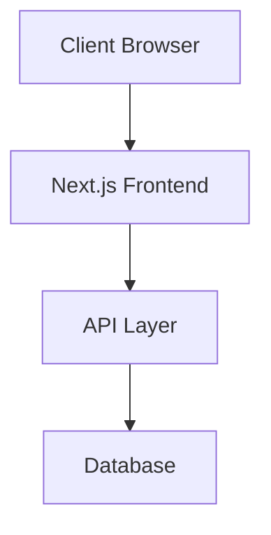

# Architecture & Engineering Principles

This document outlines the key architectural decisions, engineering principles, and technical choices that shape Afiado.

## Core Engineering Principles

### 1. Simplicity Over Complexity
- Prefer simple, maintainable solutions over clever optimizations
- Keep the codebase approachable for new contributors
- If a feature feels complex, it probably needs more design thinking

### 2. Type Safety is not optional
- Maintain strict type checking configurations
- Document type definitions clearly

### 3. Testing as a First-Class Citizen
- Maintain high test coverage for critical paths
- Write tests that serve as documentation
- Follow the testing pyramid: unit → integration → e2e

### 4. Performance by Default
- Consider performance implications in every PR
- Optimize for core web vitals
- Regular performance monitoring and benchmarking

### 5. Mobile First UI
- Build for mobile first, then desktop
- Use responsive design patterns
- Optimize for touch interactions

### 6. Build Fast, Ship Faster
- Optimize build times, for both development and production
- The faster we can build, the faster we can ship
- Use CI/CD to automate builds and tests

### 7. We love open source
- Prefer open source tools and libraries
- Share our learnings with the community
- Keep the CHANGELOG up to date

## Architecture Overview

### System Components

## Technology Choices

For each technology choice, we will consider the following:

- Context: What is the problem we are trying to solve?
- Considered Alternatives: What other technologies did we consider? List at least 3 alternatives.
- Consequences: What are the trade-offs of the chosen technology? What are the mitigation strategies for the negative consequences?

### Frontend Framework: Next.js

**Context:**
- Need for a modern framework with recognizable patterns, helping new developers get up to speed quickly
- Looking for excellent developer experience
- Require strong TypeScript support

**Considered Alternatives:**
1. [Next.js](https://nextjs.org/)
2. [React Router (Framework Mode)](https://reactrouter.com/)
3. [Tanstack Start](https://tanstack.com/start)

**Consequences: Next.js**
- Positive:
  - Faster development cycles, since is widely regarded as the de facto framework for starting a React project
  - Built-in performance optimizations
  - Great DX with hot reload and turbopack improvements reducing build times
  - Strong ecosystem, backed by Vercel
  - Allows for starting with static generation, but also has the ability to be server-side rendered
- Negative:
  - Learning curve for developers new to Next.js
  - Some lock-in to Vercel's ecosystem
  - Need to follow Next.js upgrade cycles

### Auth Provider: Clerk

**Context:**
- Need for a modern auth provider with a strong focus on user experience
- Looking for a provider that is easy to integrate with
- Preferably hosted solution, but we can self-host if necessary
- Require strong TypeScript support

**Considered Alternatives:**
1. [Clerk](https://clerk.com/)
2. [BetterAuth](https://better-auth.com/)
3. [WorkOS](https://workos.com/)

**Consequences: Clerk**
- Positive:
  - Strong TypeScript support
  - Excellent developer experience
  - Active community
  - Excellent documentation
  - Excellent support for social login providers
- Negative:
  - Some lock-in to Clerk's ecosystem
  - Hard to onboard Enterprise customers with multiple sign-in and users with different roles
- Mitigation Strategies:
  - We can consider using [WorkOS](https://workos.com/) which has a Admin Portal and a more flexible role-based access control (RBAC)
  - We can consider using [BetterAuth](https://better-auth.com/) which enables us to self-host and have more control over the user experience and the data we store about our users

## Contributing Guidelines

Refer to [CONTRIBUTING.md](./CONTRIBUTING.md) for detailed contribution guidelines. When contributing to architecture:

1. Update this document for architectural decisions
2. Maintain backwards compatibility when possible
3. Consider impact on existing contributors