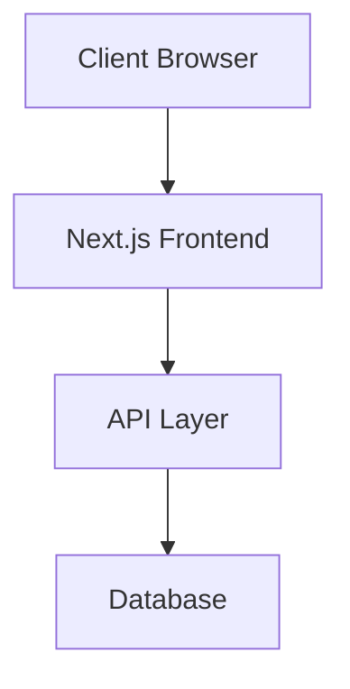

# Architecture & Engineering Principles

This document outlines the key architectural decisions, engineering principles, and technical choices that shape Afiado.

## Core Engineering Principles

### 1. Simplicity Over Complexity
- Prefer simple, maintainable solutions over clever optimizations
- Keep the codebase approachable for new contributors
- If a feature feels complex, it probably needs more design thinking

### 2. Type Safety is not optional
- Maintain strict type checking configurations
- Document type definitions clearly

### 3. Testing as a First-Class Citizen
- Maintain high test coverage for critical paths
- Write tests that serve as documentation
- Follow the testing pyramid: unit → integration → e2e

### 4. Performance by Default
- Consider performance implications in every PR
- Optimize for core web vitals
- Regular performance monitoring and benchmarking

### 5. Mobile First UI
- Build for mobile first, then desktop
- Use responsive design patterns
- Optimize for touch interactions

### 6. Build Fast, Ship Faster
- Optimize build times, for both development and production
- The faster we can build, the faster we can ship
- Use CI/CD to automate builds and tests

### 7. We love open source
- Prefer open source tools and libraries
- Share our learnings with the community
- Keep the CHANGELOG up to date

## Technology Choices

### Frontend Framework: Next.js

**Decision Date:** [Insert Date]

**Context:**
- Need for a modern React framework
- Looking for excellent developer experience
- Require strong TypeScript support

**Considered Alternatives:**
1. Remix
2. Gatsby
3. Create React App
4. Astro

**Decision Factors:**
- Production-proven at scale
- Large, active community
- Built-in performance optimizations
- File-based routing
- API routes support
- Excellent TypeScript integration
- Vercel's strong backing and support

**Consequences:**
- Positive:
  - Faster development cycles
  - Built-in performance optimizations
  - Great DX with hot reload
  - Strong ecosystem
- Negative:
  - Learning curve for developers new to Next.js
  - Some lock-in to Vercel's ecosystem
  - Need to follow Next.js upgrade cycles

### [Other Technology Choice]

[Follow same format for other major technology choices]

## Architecture Overview

### System Components



### Key Design Patterns

1. **Feature-based Directory Structure**
   ```
   src/
   ├── features/
   │   ├── auth/
   │   ├── dashboard/
   │   └── transactions/
   ```

2. **State Management**
   - React Query for server state
   - Context API for global UI state
   - Local state when possible

3. **API Design**
   - RESTful principles
   - Strong typing with TypeScript
   - OpenAPI documentation

## Performance Considerations

### Client-Side
- Implement code splitting
- Optimize image loading
- Minimize JavaScript bundles
- Use appropriate caching strategies

### Server-Side
- Implement edge caching where possible
- Optimize database queries
- Monitor server response times

## Security Principles

1. **Authentication & Authorization**
   - JWT-based authentication
   - Role-based access control
   - Regular security audits

2. **Data Protection**
   - Encrypt sensitive data at rest
   - Secure API endpoints
   - Follow OWASP guidelines

## Monitoring & Observability

1. **Metrics We Track**
   - Core Web Vitals
   - Error rates
   - API response times
   - User engagement metrics

2. **Tools We Use**
   - [List monitoring tools]

## Contributing Guidelines

Refer to [CONTRIBUTING.md](./CONTRIBUTING.md) for detailed contribution guidelines. When contributing to architecture:

1. Update this document for architectural decisions
2. Maintain backwards compatibility when possible
3. Consider impact on existing contributors